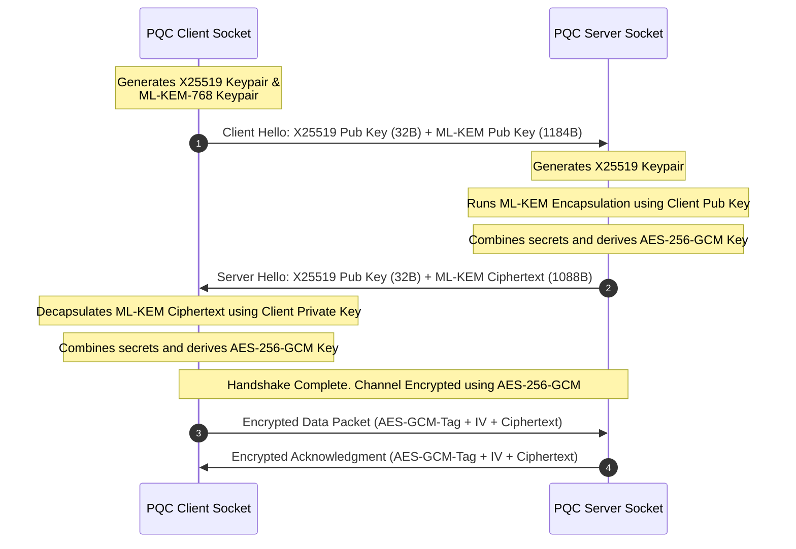

# Hybrid Cryptographic Blueprints

To mitigate the risk of zero-day vulnerabilities in newly standardized post-quantum algorithms, this framework implements a **dual-cryptography model**. All secure sessions require verification of both a classical algorithm (for historical compliance and trust) and a lattice-based algorithm (for quantum resilience).

---

## 1. Key Encapsulation (ECDH + ML-KEM-768)

The hybrid KEM combines **X25519 Elliptic Curve Diffie-Hellman (ECDH)** and **ML-KEM-768 (Kyber)**.

```
                  ┌──────────────────────┐
                  │ Classical Secret (S1)│
                  │   (X25519 Shared)    │
                  └──────────┬───────────┘
                             │
                             ▼             ┌─────────────────────┐
                     [Concatenation] ◄─────┤ Quantum Secret (S2) │
                             │             │ (ML-KEM-768 Shared) │
                             ▼             └─────────────────────┘
                 ┌───────────────────────┐
                 │ Combined Secret (S1|S2│
                 └──────────┬────────────展
                            │
                            ▼
                         [HKDF]
                            │
                            ▼
                ┌────────────────────────┐
                │ AES-256-GCM Session Key│
                └────────────────────────┘
```

### Key Derivation Protocol
1.  **Secret Concatenation:** Combine the 32-byte X25519 ECDH shared secret ($S_1$) and the 32-byte ML-KEM shared secret ($S_2$).
    $$\text{Combined Secret} = S_1 \mathbin{\Vert} S_2$$
2.  **HKDF Extraction & Expansion:** Feed the combined 64-byte secret into a Hash-based Key Derivation Function (HKDF) using SHA-256:
    $$\text{Session Key} = \text{HKDF-Expand}(\text{HKDF-Extract}(\text{Salt}, S_1 \mathbin{\Vert} S_2), \text{Info}, 32)$$

---

## 2. Secure Socket Handshake Flow

The `PQCSocket` executes the following handshake exchange over TCP:



---

## 3. Dual Signatures (ECDSA + ML-DSA-65)

Payload authentication uses combined **ECDSA (secp256r1)** and **ML-DSA-65 (Dilithium)** digital signatures.

### Signing Protocol
Given a payload $M$:
1.  Calculate classical signature: $Sig_{classical} = \text{ECDSA-Sign}(M, Priv_{ECDSA})$
2.  Calculate quantum signature: $Sig_{quantum} = \text{ML-DSA-Sign}(M, Priv_{ML-DSA})$
3.  Transmit package: $(M, Pub_{ECDSA}, Sig_{classical}, Pub_{ML-DSA}, Sig_{quantum})$

### Verification Protocol
1.  Verify $Sig_{classical}$ using $Pub_{ECDSA}$. If invalid, reject.
2.  Verify $Sig_{quantum}$ using $Pub_{ML-DSA}$. If invalid, reject.
3.  If both verifications succeed, the message is declared authentic.
