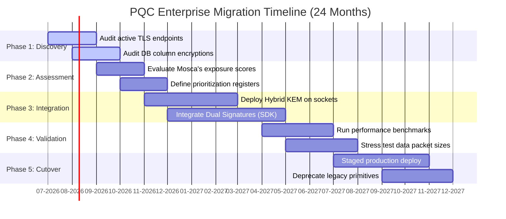

# Post-Quantum Cryptography Migration Roadmap

Implementing post-quantum cryptography requires a structured timeline to transition systems without causing operational downtime. This document outlines the five phases of the migration roadmap.

---

## 1. The 5-Phase Migration Model

```
 ┌─────────────┐     ┌─────────────┐     ┌─────────────┐     ┌─────────────┐     ┌─────────────┐
 │   PHASE 1   │     │   PHASE 2   │     │   PHASE 3   │     │   PHASE 4   │     │   PHASE 5   │
 │  Discovery  ├────►│  Assessment ├────►│ Hybrid PQC  ├────►│ Validation  ├────►│ PQC Cutover │
 │  & Audit    │     │  & Priority │     │ Integration │     │ & Hardening │     │   (Final)   │
 └─────────────┘     └─────────────┘     └─────────────┘     └─────────────┘     └─────────────┘
```

### Phase 1: Discovery & Audit (Months 1-3)
*   **Actions:** Identify all active encryption endpoints, SSL/TLS configurations, database field encryption layers, and digital signature verify schemes.
*   **Deliverables:** Centralized Cryptographic Inventory Registry.

### Phase 2: Threat Assessment & Priority (Months 3-6)
*   **Actions:** Apply Mosca's Theorem ($L + M > C$) to calculate threat scores. Group systems into Immediate, High, and Medium priority brackets.
*   **Deliverables:** Risk Exposure Report and Executive Budget Sign-off.

### Phase 3: Hybrid Cryptography Integration (Months 6-12)
*   **Actions:** Implement hybrid key exchanges (X25519 + ML-KEM) and dual signatures (ECDSA + ML-DSA) in dev/staging environments. Ensure all external client libraries are crypto-agile.
*   **Deliverables:** Staging Deployment of Hybrid Wrappers (such as our `pqc_sdk`).

### Phase 4: Validation & Hardening (Months 12-18)
*   **Actions:** Run compatibility stress-testing, measure bandwidth overhead (larger KEM ciphertexts/signature packets), and execute adversarial red-team simulations (simulating Harvest Now, Decrypt Later captures).
*   **Deliverables:** Performance Benchmark Metrics and Penetration Testing Sign-off.

### Phase 5: PQC Cutover (Months 18-24)
*   **Actions:** Transition production systems to hybrid mode. Deprecate legacy key templates. Prepare configuration options to transition to pure quantum-safe primitives when standardized by regulatory bodies.
*   **Deliverables:** Quantum-Hardened Production Environment.

---

## 2. Migration Timeline Gantt Chart

Below is the visual schedule of the migration pipeline:


